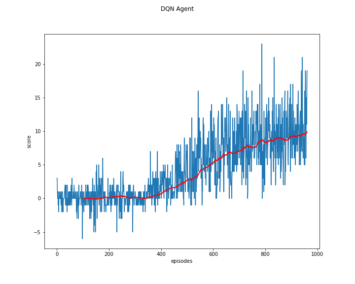
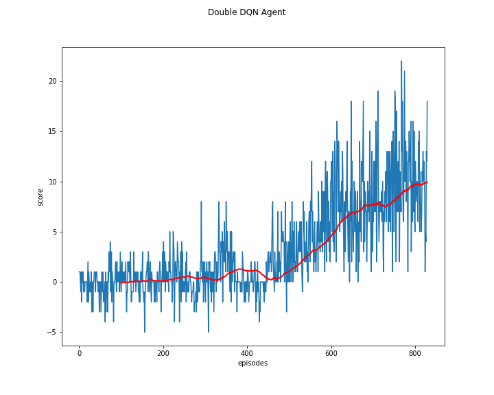

# Report for solving the Banana Navigation task

## DQN

The first algorithm I worked on for this project is the [ Deep Q-Networks](https://storage.googleapis.com/deepmind-media/dqn/DQNNaturePaper.pdf).
You can see the neural network in `pytorch/dqn.py` and the DQN agent in `pytorch/dqn_agent.py`. The architecture is:
- Linear layer with environment states as input mapped to 64 nodes
- ReLu activation
- Linear layer with again 64 nodes/features
- ReLu activation
- Linear output layer that maps to the action dimension

below you can see the hyperparameters that are initiated in the dqn agent
```python
class DQNAgent():

    def __init__(self, state_size: int, action_size: int):
        self.buffer_size = int(1e5)
        self.batch_size = 64
        self.tau = 1e-3
        self.update_every = 4
        self.state_size = state_size
        self.action_size = action_size
        self.gamma = 0.99
        self.epsilon = 1.0
        self.epsilon_min = 0.01
        self.epsilon_decay = 0.995
        self.learning_rate = 0.0005
        self.checkpoint_path = "checkpoints/pytorch/dqn/cp-{epoch:04d}.pt"
```

The `run_dqn.py` script trains the dqn_agent and saves the weights in the `checkpoints` folder. I copied the last run to `weights/dqn`.
In the jupyter notebook the graph from the training scores is loaded and an agent with the trained weights.

## Double DQN

The [Double DQN](https://arxiv.org/abs/1509.06461) algorithm works a little bit better.
The Network is the same model as in the DQN model. The only change is how the update of the target is calculated.

Below the hyperparameters:
```python
class DoubeDQNAgent():

    def __init__(self, state_size: int, action_size: int):
        self.buffer_size = int(1e5)
        self.batch_size = 64
        self.tau = 1e-3
        self.update_every = 4
        self.state_size = state_size
        self.action_size = action_size
        self.gamma = 0.99
        self.epsilon = 1.0
        self.epsilon_min = 0.01
        self.epsilon_decay = 0.995
        self.learning_rate = 0.0005
        self.checkpoint_path = "checkpoints/pytorch/double_dqn/cp-{epoch:04d}.pt"
```
As you can see they are the same as in the dqn agent.

The `run_doubledqn.py` script trains the dqn_agent and saves the weights in the `checkpoints` folder. I copied the last run to `weights/double_dqn`.
In the jupyter notebook the graph from the training scores is loaded and an agent with the trained weights.

### Results fom training the agents

In the `unity_banana_navigation.ipynb` you can see the agents loaded with my trained weights and the plots of the scores during learning.
Plots of the scores from the notebook are also saved in 'dqn_score_plot.png' and 'double_dqn_score_plot.png'.
In blue are the scores and the red line shows the mean of a 100 episode window.

DQN:



Double DQN:



The DQN agent needed 960 episodes to solve the task of reaching a mean of 10.0 over a 100 episode sliding window. 
Double DQN works a little bit better and needed 829 episodes.

## Further Research
To improve the results the next step would be to try out the dueling dqn and a [Preoritized Experience Replay](https://arxiv.org/abs/1511.05952)
Depending on how the replay buffer samples data for the agent to use as experience, you could be unlucky and recieve a sample with low score trajectories.
Preoritizing high score replay could make the training more stable and efficient. 

You can see in the score plots that there is a lot of fluctuation in the scores. This could be improved by: 
- using a better replay buffer
- update of weights slower with different learning rate for the optimizer
- instead of the hard update from the local network to the target network a soft update, as used in the reacher and tennis problems, could also smooth the learning

